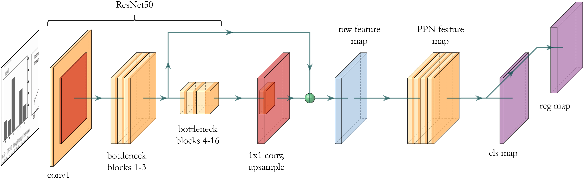
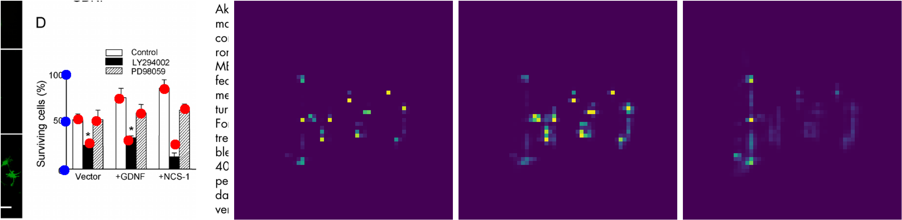
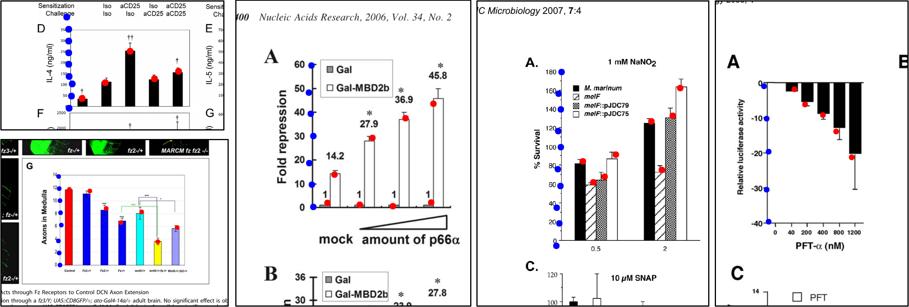
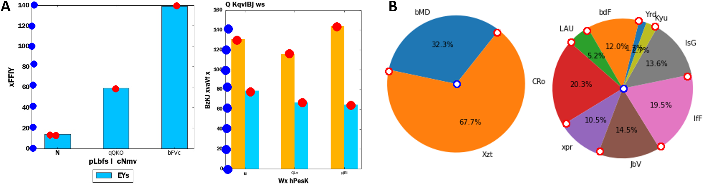

# Point Proposal Network

A CNN model for value detection in data charts, to enable automated reverse engineering of charts in scientific articles.

## PPN Model

The model is a convolutional per-pixel point predictor that yields propossed salient data points and their class. It uses a ResNet-50 backbone and is similar to both an image segmentation model and a region proposal model (like that in Faster R-CNN), except that 1) pixel predictions are not dense, and 2) no feature map ROI (region-of-interest) cropping is necessary. Our approach is easy to annotate and train, and the method is readily extensible to multiple chart types, as demonstrated below.

The point class maps produced are converted to per-class point lists (data axis tick marks and bar peaks, for the case of bar charts), and filtered via non-maximum suppression.

## Datasets

We use syntheticly generated charts (produced with Matplotlib) to pretrain our model, and then fine-tuned and evaluated on manually annotated bar charts extracted from the scientific literature (from PubMed Central Open Access subset). We also used clips of real charts to augment synthetic data and thus incorporate representative spurious artifacts for improved training on synthetic data. Our synthetic data generation scripts and manual annotations are included.

## Sample Results

We evaluate our method on complex real charts extracted from scientific articles, on which it achieves strong performance (87.05 F1 @ 2.7% error). This is in contrast to prior methods which are demonstrated on synthetic-only, or otherwise very simplistic and clean charts (our method achives 98.1 F1 on such data). Our focus is bar charts, however we demonstrate that the exact same method may be successfuly applied to other chart types, such as pie charts. These results are with no changes to the model definition, hyperparameters, nor prediction thresholds. Only the annotation types are changed (e.g. pie wedge edges and chart center, rather than data axis tick marks and bar peaks).

## Paper

[currently under annonymous review]
